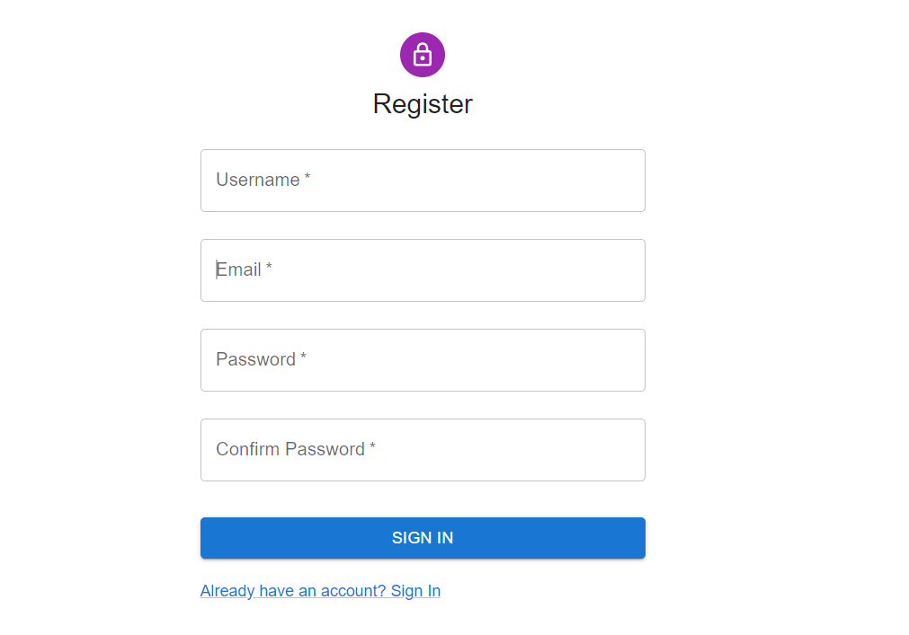

# Tech stack
- Frontend - React (Type Script), Material UI
- Backend - Django (Python)
- Database - Postgres (Models with django ORM)

# Note

The build folder is also provided in the backend which server the static files of the react frontend. So, there is no need to run frontend react application seperately.

# Installation

- Install the modules in the backend requirements folder.
  ```
  pip install -r requirements.txt
- Configure the .env file in the backend folder.
- You should have the following variables in your .env file:
  ```env
  DJANGO_SECRET_KEY='your django secret key'
  DB_NAME='db name'
  DB_USER='db user'
  DB_PWD='db password'
  DB_HOST='db host'
  DB_PORT='db port'
  ALPHA_VANTAGE_KEY='you can get a free api key from the alpha vantage website'

- run your application with the command
  ```python
  python manage.py runserver
# Interface
# Register Page


# Login Page


# Dashbaord Page

